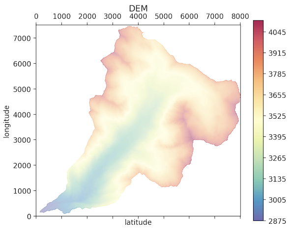
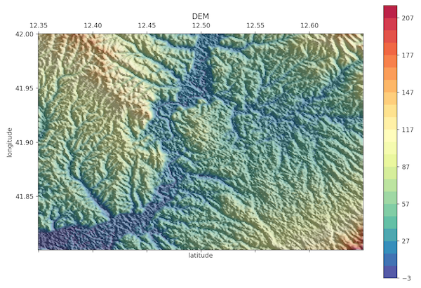
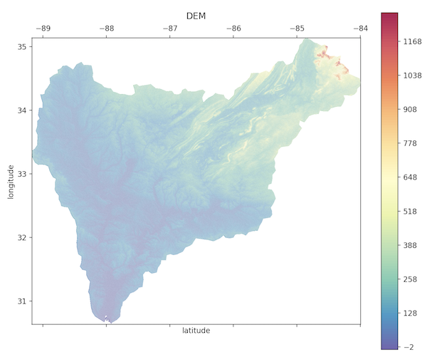
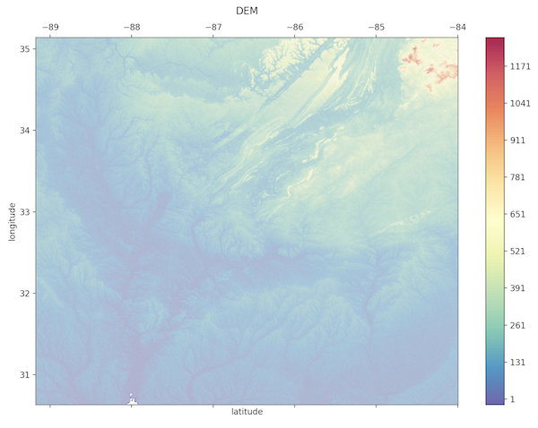

# Importing DEMs and GIS data

## The DEM class structure

After reading or downloading a DEM, an object of type `tinerator.DEM` is returned. This class contains all information related to tinning a particular GIS object: GIS data, such as the DEM matrix and shapefile polygons, meshing data, spatial data, and more. Further information on this class can be found by reading the [API Documentation](../api/index.md).

The DEM - and associated metadata - is stored in the `tinerator.DEM.dem` attribute, which itself is a [`richdem.rdarray`](https://richdem.readthedocs.io/en/latest/python_api.html#richdem.rdarray) object:

```python
>>> print(my_dem.dem.__dict__)
{
  'metadata': {
    'PROCESSING_HISTORY':
       '\n2019-01-23 18:53:20.598492 UTC | RichDEM (Python 0.3.4) (hash="ee05922", hashdate="2018-07-13 13:01:09 -0700") | LoadGDAL(filename=data/dem.asc, no_data=-9999.0)'},
  'no_data': -9999.0,
  'projection': '',
  'geotransform': (0.0, 10.0, 0.0, 7510.0, 0.0, -10.0)
}
```

Upon load, this metadata is parsed into specific `tinerator.DEM` variables. It is unlikely an end-user will need access to this RichDEM metadata.

## Reading DEMs

### Reading a DEM by file

Reading a DEM via file is simply called by:

```python
my_dem = tinerator.loadDEM("data/dem.asc")
```

The loading function uses GDAL as the I/O driver. Supported input filetypes can be [found here](https://www.gdal.org/formats_list.html).

To verify import integrity, we can then plot the DEM and print metadata:

```python
my_dem.plot()
```


```python
print("NODATAVALUE: {0}\nLower-left Corner: ({1},{2})\nCell Size: {3}"
  .format(
      my_dem.no_data_value,
      my_dem.xll_corner,
      my_dem.yll_corner,
      my_dem.cell_size
  )
)
```
```
>>> NODATAVALUE: -9999.0
>>> Lower-left Corner: (0.0,0.0)
>>> Cell Size: 10.0
```

Each of these metadata values are mutable and can be changed as circumstances dictate.

### Downloading from coordinates

To download an SRTM 90m DEM by through a latitude / longitude bounding box,

```python
my_dem = tinerator.downloadDEM(bounds=(12.35,41.8,12.65,42),
                               outfile='Rome-90m-DEM.tif')
```

where `bounds` is the bounding box values in geodetic coordinates (left, bottom, right, top), and `outfile` is an optional filepath to save the DEM.

In this example, `(12.35,41.8,12.65,42)` represents a subsection of Rome:



### Downloading by Shapefile

To download an SRTM 90m DEM through a Shapefile (`.shp`), 

```python
my_dem = tinerator.downloadDEM(shapefile="shapefile.shp",crop=True)
```

The argument `crop` replaces all areas of the DEM not covered by the shapefile with a NoDataValue. Setting `crop = False` will only return a DEM bound by the spatial domain of the shapefile.

**With `crop = True`:**


**With `crop = False`:**


## Applying a Shapefile

*Coming soon*