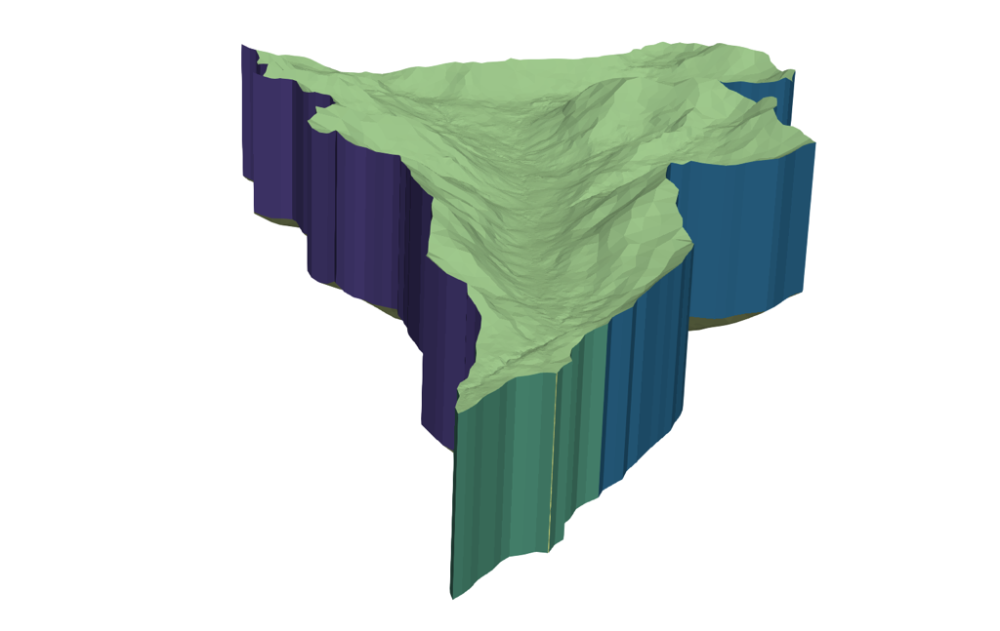
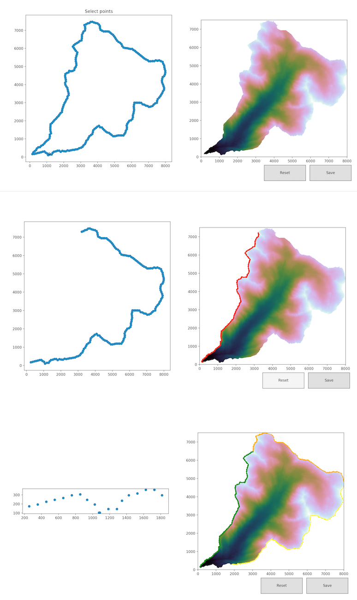

# Facesets

Facesets are arbitrarily defined sections of the mesh's surface, which can be used in simulators such as ATS or Amanzi to define boundary conditions. A mesh using facesets is exported in the Exodus ([PDF](http://gsjaardema.github.io/seacas/exodusII-new.pdf)) format.

## Naive Facesets

'Naive' facesets are a collection of only three facesets: top, bottom, and sides.
They can be generated with:

```python
my_dem.generateFacesets(output_filepath,naive=True)
```

## Complex Facesets



In the above image, six distinct facesets are shown:

* Top layer
* Bottom layer
* Side (East)
* Side (West)
* Side (South)
* Outlet

Note that the outlet faceset is localized entirely to the top layer.

Faceset definitions such as these are unique to simulation parameters and goals.
Consequently, they must be defined manually using one of two methods:

### Side selection via GUI

```python
fs_sides = selectFacesetsFromBoundary(dem)
```

Upon running the above function, a Matplotlib-powered GUI will appear and Python will suspend further script execution until the window is closed.

To use this tool, simply click a boundary node defining the start of a sideset.
Then, in a clockwise manner, click the boundary node defining the end of a sideset. Nodes contained within that sideset will disappear from the boundary as
they are no longer selectable.

This process may be performed an arbitrary amount of times - note that the nodes 
'left over' when the GUI window is closed will be defined as a sideset.



When the window is closed, the function will return an array with sideset definitions. 

You can also run this function again to define top-layer sidesets - for, as an example, defining an inlet or outlet. 

```python
fs_sides = selectFacesetsFromBoundary(dem)  # Capture general sidesets
fs_outlet = selectFacesetsFromBoundary(dem) # Capture the outlet sideset (top layer only!)
my_dem.generateFacesets('facesets_example.exo',facesets={'all': fs_sides,
                                                         'top': fs_outlet})
```

### Side selection via Coordinates

If already you know the coordinates of the sidesets you wish to define, you can create an array defining starting/ending boundary nodes (in *clockwise order*). Note that the coordinate space must be the same as the DEM.

As an example, consider the following:

```python
scoords = {
            'all': np.array([[3352.82,7284.46],
                             [7936.85,4870.53],
                             [1798.4, 256.502],
                             [1182.73,1030.19]]),

            'top': np.array([[780.41,304.79],
                             [567.05,524.24]])
           }

fs = getFacesetsFromCoordinates(scoords,my_dem.boundary)
my_dem.generateFacesets('facesets_example.exo',facesets=fs)

```

The above code generates the exact same sidesets as in the GUI example.

### Top surface selection

*Feature under development*
