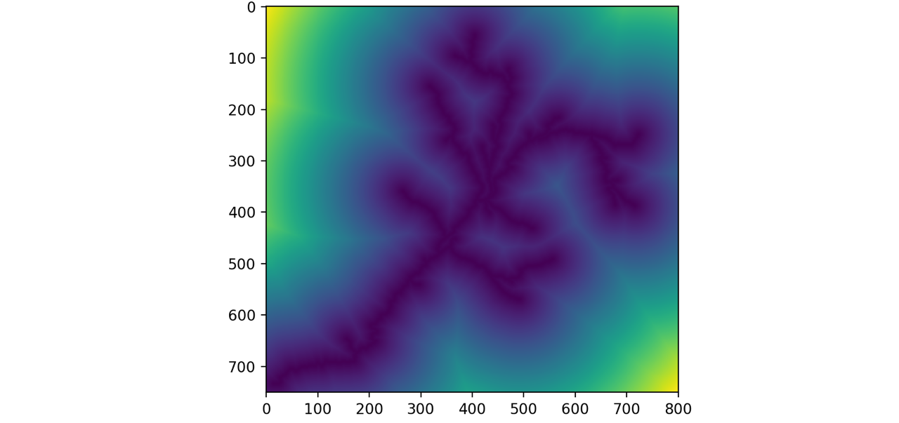
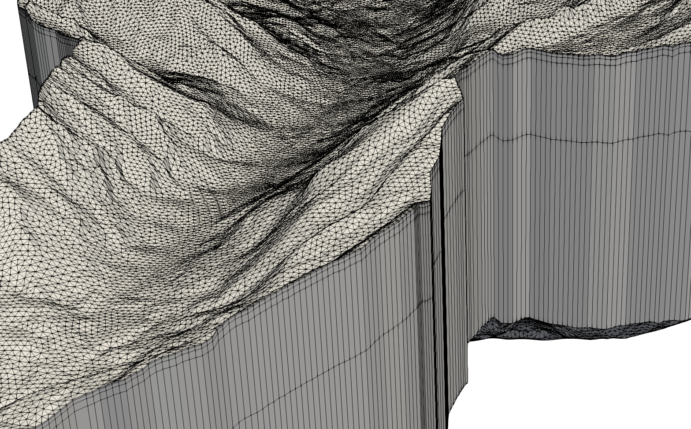
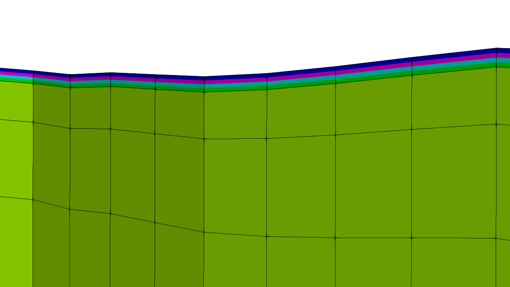

# Mesh Generation

At this point, the DEM should be sufficiently post-processed, and
we can begin the process of constructing a TIN.

TIN generation is done in several discrete steps:

1. Triplane (surface) generation
2. Applying elevation to surface
3. Extruding into defined layers
4. Applying materials to layers

Steps 1+2 and steps 3+4 are controlled with the following methods, respectively:

```python
tinerator.DEM.generateStackedTIN(**kwargs) # Steps 1 & 2
tinerator.DEM.layeredMesh(**kwargs)        # Steps 3 & 4
```

Details on using these methods will be explained in the subsections below; for
more information, read the [method documentation](null.md).

## Building a Surface Mesh

By default, TINerator will automatically determine whether to contruct a surface
with refined or uniform triangles. If watershed delineation has not been performed,
or the class variable `tinerator.DEM.feature = None`, then TINerator will 
generate a uniform surface. Otherwise, it will be refined.

The generated surface mesh will maintain the same spatial domain as the parent 
DEM. This may cause overflow errors if the DEM domain is close to or exceeds
the limit of a double-precision float.

### Uniform

Once the boundary is generated, calculating a triplane is as simple as:

```python
my_dem.generateStackedTIN()
```

The minimum edge length of the surface triangles will be equivalent to the spacing
between adjacent boundary nodes, as defined in `tinerator.DEM.generateBoundary()`.


To define a different edge length, use the method parameter `min_edge:float`, where
the units of `min_edge` are the same units as the parent DEM.

By default, DEM elevation data will be continuously interpolated onto the
Z-values of the surface triangles. A completely flat mesh can be constructed 
instead with the method argument `apply_elevation = False`.

### Refined

For generating a refined surface, call the method:

```python
my_dem.generateStackedTIN(min_edge)
```

where `min_edge` will be the shortest edge generated in the refining process.

This method works by (i) coarsely triangulating the interior of the boundary,
and (ii) adaptively refining triangles according to a gradient field.

The gradient field is a raster with values that scale relative to the Euclidean
distance from the feature.



Triangle edge length scales linearly from `min_edge`, where the gradient field is
0 (at the feature), towards `max_edge`, where the gradient field is 1 (at the
edge of the DEM domain), according to this equation:

$$e(i,j) = e_{min} + \left( e_{max} - e_{min} \right) \cdot \nabla D(i,j)$$


As stated above, DEM elevation data will be interpolated onto the Z-coordinate
of the surface nodes unless explicitly defined otherwise.

### Mesh Quality

Triangulation is done with a [Delaunay triangulation](http://www.geom.uiuc.edu/~samuelp/del_project.html) algorithm, and 
the mesh is iteratively smoothed with [Laplacian smoothing](https://dl.acm.org/citation.cfm?doid=1057432.1057456).
The number of smoothing / reconnection iterations can be controlled with the keyword `iterations:int`.

Mesh quality can be found through the method:

```python
tinerator.DEM.quality('surface')
```

This returns a dictionary containing aspect ratio statistics ($\theta_{max} / \theta_{min}$),
edge length ratio statistics ($e_{max} / e_{min}$), and count of malformed
elements (triangles with very large angles, very small angles, or very small areas).

## Stacking the Mesh

Mesh extrusion is the process of extruding a triangular surface mesh into a 
volumetric prism mesh. This method is called using

```python
tinerator.DEM.layeredMesh(**kwargs)
```

For more information, see the [documentation](null.md).

As an example, after generating a triangular surface mesh, it can be layered by:

```python
layers = [0.1, 0.3, 0.6, 8., 21.] # Define layer thickness
matids = [  1,   2,   3,  4,   5] # Define material ID

my_dem.layeredMesh(layers,matids=matids)
```

where `layers` is a list of length *N*, containing the sequential depths of
layers to extrude, and `matids` is a list of length *N* containing the
sequential integer IDs for each layer.

For example, layer 1 will have a depth of 0.1 meters and a material ID of 1,
layer 2 will have a depth of 0.3 and a material ID of 2, and so on.


!!! note
    The length of list `layers` *must* equal the length of list `matids`

### Layers

Depending on your particular use case, you may want as few as one layer, or 
many more. Layers may be of any arbitrary thickness, with units the same as the DEM parent.

Note that the number of elements in the volumetric mesh, $N_{volume}$,
is directly proportional to the number of layers $n_{layers}$:

$$ N_{volume} = N_{surface} \cdot n_{layers} $$


*Five-layer prism mesh. Layer depths have been strongly exaggerated for effect.*

### Materials

Each layer can optionally have its own material ID - this provides an easy way to identify
which layer an element is in, or to find elements within a defined layer. Note
that material ID is not necessarily an attribute - it is a non-zero integer
value mapped to an element. Cell and node based attributes are applied using a 
different process - [read more here](attributes.md).


*An exaggerated view of layers colored by material ID. Note that some values are
unique to its layer, while other layers share an ID.*
